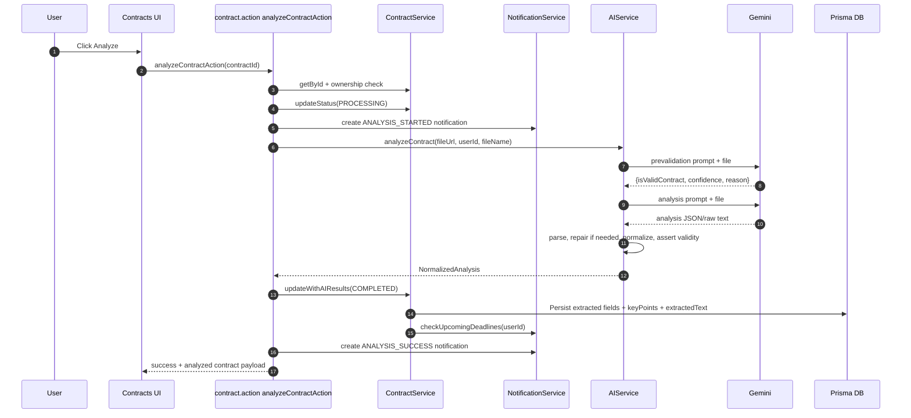
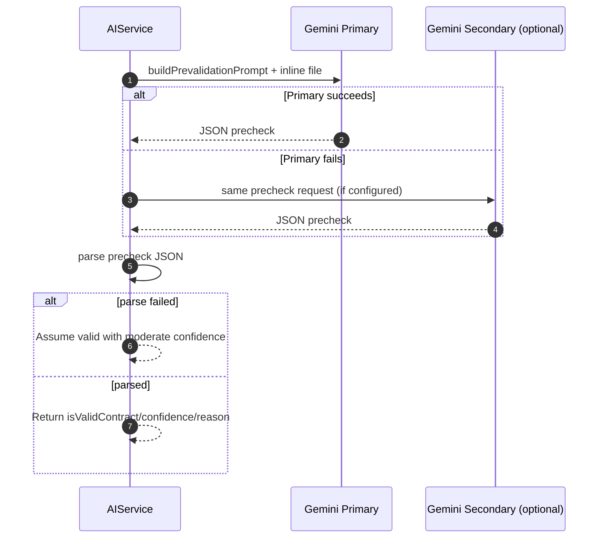
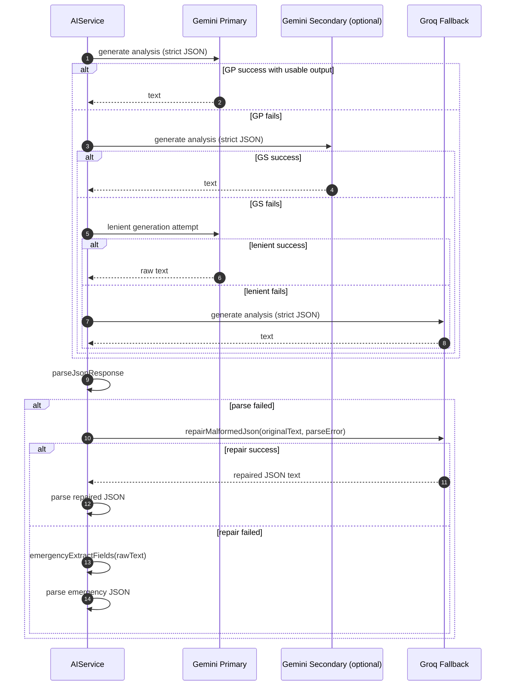
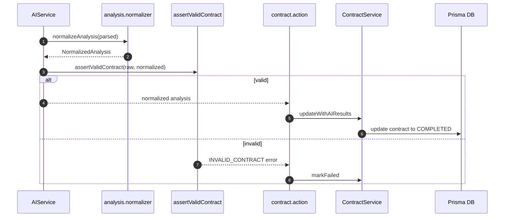
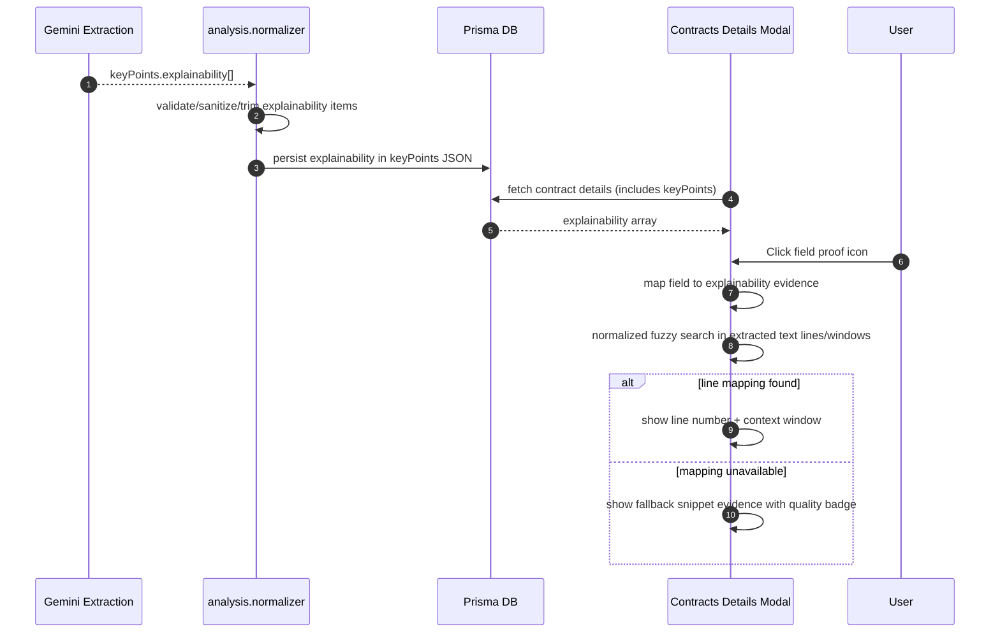
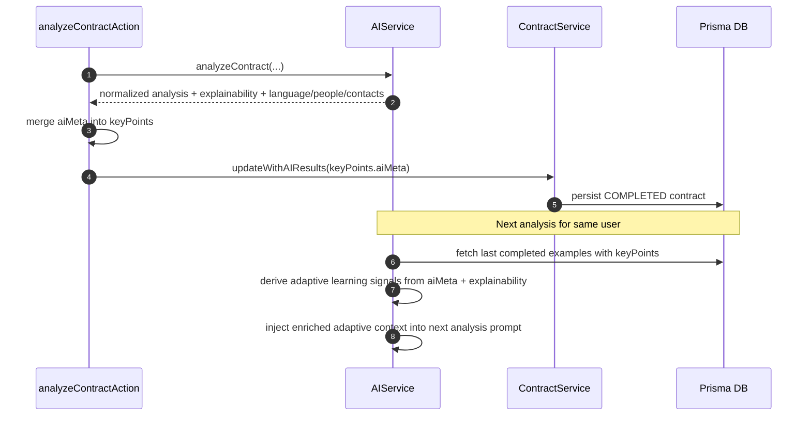
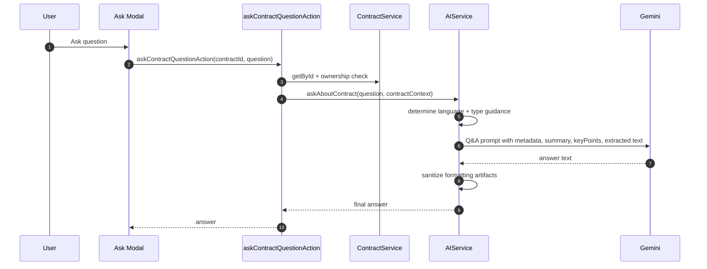
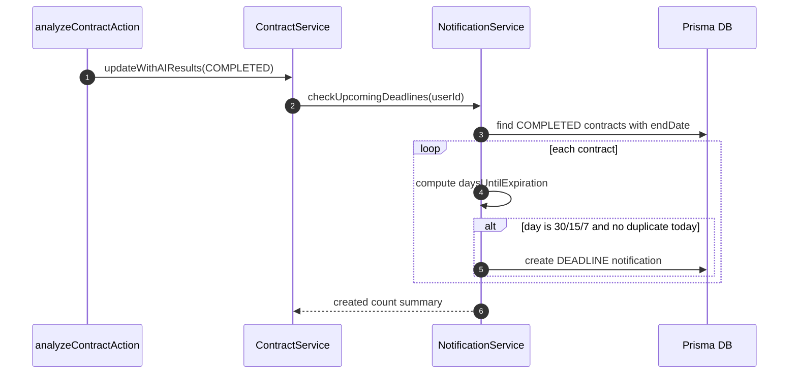

# AI Features Documentation

## 1. Overview

This document explains all AI-powered capabilities currently implemented in the BFSI contract analysis application, how data flows through the system, what resilience mechanisms are in place, and how explainability is surfaced to users.

### 1.1 AI Flow for Juniors (Start Here)

If you are new to the codebase, this is the exact AI lifecycle from upload to UI proof:

1. User uploads a document and opens it in dashboard details.
2. Analyze action validates ownership and marks status as PROCESSING.
3. AI prevalidation checks if the file is a real contract.
4. Main extraction runs with primary model; fallback model is used if needed.
5. Output is parsed, repaired when malformed, normalized to strict shape, and validated.
6. Results are persisted in DB (title, dates, premium, summary, key points, explainability evidence, extracted text).
7. Continuous learning metadata (aiMeta) is stored in keyPoints for future adaptive prompts.
8. UI shows extracted fields and proof icons next to each critical field.
9. Clicking a proof icon opens Field Proof modal:

- tries to map evidence snippet to exact line(s) in extracted text using normalized fuzzy matching,
- runs deterministic field-aware checks first (exact snippet/date/value line) before fuzzy scoring,
- falls back to snippet evidence when precise line mapping is not possible.

11. Premium amount keeps source currency semantics:

- AI is instructed to return numeric premium without conversion,
- AI also returns premiumCurrency (for example TND, USD, EUR),
- UI displays premium using detected source currency (no forced EUR formatting).

10. Q&A and reminders reuse the persisted AI output.

### 1.2 Where to Read in Code

- Orchestration: `lib/actions/contract.action.ts`
- AI core + retries + validation: `lib/services/ai.service.ts`
- Prompt contracts: `lib/services/ai/analysis.prompt.ts`
- Parser + normalizer: `lib/services/ai/analysis.parser.ts`, `lib/services/ai/analysis.normalizer.ts`
- UI proof rendering: `components/views/dashboard/contracts-list.tsx`

The AI subsystem is centered on:

- Contract prevalidation (contract vs non-contract detection)
- Contract analysis and structured field extraction
- Multi-model fallback and JSON repair
- Normalization and validation hardening
- Explainability evidence for extracted fields
- Multilingual contract Q&A
- AI-derived deadline reminders
- Field-level proof modal with line-context evidence mapping
- Snippet text search inside extracted snippets
- Continuous learning context from previous analyses (without schema migration)

## 2. Tech and Configuration

### 2.1 Core Components

- Next.js server actions for orchestration
- Gemini via @google/generative-ai for extraction and Q&A
- Prisma for persistence
- Clerk for authenticated user context
- React client UI for details modal, field-proof modal, and chat

### 2.2 Models

- Primary model: gemini-2.5-flash
- Optional secondary Gemini model: AI_MODEL_SECONDARY_GEMINI
- Fallback model provider: Groq (default: llama-3.3-70b-versatile)
- Gemini models are de-duplicated and iterated in order before Groq fallback
- Groq extraction fallback currently applies to image inputs in this pipeline; JSON repair and Q&A fallback are text-based

### 2.3 Environment Variables

- AI_API_KEY (or AI_API_KEY2 / AI_API_KEY3 fallback)
- AI_MODEL_PRIMARY (optional override)
- AI_MODEL_SECONDARY_GEMINI (optional override)
- AI_MODEL_FALLBACK (optional override)
- GROQ_API_KEY (or AI_GROQ_API_KEY)

## 3. AI Capability Matrix

| Capability                    | Trigger                           | Output                                                             | Main File                                                                                                                   |
| ----------------------------- | --------------------------------- | ------------------------------------------------------------------ | --------------------------------------------------------------------------------------------------------------------------- |
| Prevalidation                 | Analyze action                    | isValidContract, confidence, reason                                | lib/services/ai.service.ts                                                                                                  |
| Structured extraction         | Analyze action                    | title/type/provider/policy/dates/premium/summary/key points        | lib/services/ai.service.ts                                                                                                  |
| Premium currency preservation | Analyze + normalize + UI display  | premium + premiumCurrency with no currency conversion              | lib/services/ai/analysis.prompt.ts + lib/services/ai/analysis.normalizer.ts + components/views/dashboard/contracts-list.tsx |
| Explainability extraction     | Structured extraction prompt      | field-level why + snippet + hints                                  | lib/services/ai/analysis.prompt.ts                                                                                          |
| JSON repair                   | Parse failure                     | corrected JSON                                                     | lib/services/ai.service.ts                                                                                                  |
| Emergency extraction          | Repair failure                    | minimal valid analysis JSON                                        | lib/services/ai.service.ts                                                                                                  |
| Normalization                 | Post-parse                        | canonical, bounded, safe analysis object                           | lib/services/ai/analysis.normalizer.ts                                                                                      |
| Contract validity assertion   | Post-normalization                | pass/fail with invalid-contract reason                             | lib/services/ai.service.ts                                                                                                  |
| Contract Q&A                  | Ask action                        | multilingual business/legal-oriented answer                        | lib/services/ai.service.ts                                                                                                  |
| Deadline reminders            | Contract save after AI completion | DEADLINE notifications at 30/15/7 days                             | lib/services/notification.service.ts                                                                                        |
| Explainability UI             | Details modal                     | field-level proof icon, line-context modal, fuzzy evidence mapping | components/views/dashboard/contracts-list.tsx                                                                               |
| Evidence quick copy           | Details modal                     | one-click clipboard copy of compliance evidence bundle             | components/views/dashboard/contracts-list.tsx                                                                               |
| Snippet search                | Details modal                     | text/field search inside extracted snippets                        | components/views/dashboard/contracts-list.tsx                                                                               |
| Continuous learning context   | Every completed analysis          | adaptive context enriched from historical aiMeta/evidence          | lib/actions/contract.action.ts + lib/services/ai.service.ts                                                                 |

## 4. Feature Details and Sequence Diagrams

---

## 4.1 AI Contract Analysis End-to-End

### What it does

When a user clicks Analyze, the system validates ownership, marks contract as PROCESSING, performs AI prevalidation and extraction, validates results, saves structured output, and returns success or failure.

### Key resilience points

- Ownership checks before all sensitive operations
- Invalid-contract short-circuit based on AI confidence and heuristics
- Multi-pass retry with correction hints
- Multi-model fallback

### Sequence Diagram

---

## 4.2 Contract Prevalidation Gate

### What it does

Before expensive extraction, AI classifies whether the uploaded document is actually a contract in any language.

### Decision rules

- Rejects obvious non-contract files (invoices, IDs, blank pages, random images)
- If parse of prevalidation JSON fails, system defaults to permissive moderate confidence to avoid false negatives due malformed precheck output

### Sequence Diagram

---

## 4.3 Multi-Model Extraction + JSON Repair + Emergency Fallback

### What it does

If extraction output is malformed or incomplete, the service tries progressively stronger recovery paths.

### Recovery layers

1. Primary/Fallback model extraction with strict JSON mime type
2. Lenient generation (no forced responseMimeType JSON)
3. JSON repair pass with schema guidance
4. Emergency field extraction from raw text patterns

### Sequence Diagram

---

## 4.4 Normalization, Validation, and Persistence

### What it does

Raw model output is converted into a strict normalized contract object and validated before DB write.

### Normalization highlights

- Contract type alias mapping into supported enum
- Date coercion to YYYY-MM-DD
- Safe string truncation and null handling
- Premium normalization and bounds
- Explainability normalization with bounded field lengths and confidence clamping
- Extracted text cap at 12000 chars

### Sequence Diagram

---

## 4.5 Explainability Pipeline and UI Interaction

### What it does

The model is instructed to provide extraction evidence per field. The UI renders a compact proof icon near each extracted field and opens a dedicated Field Proof modal with source snippet, metadata, and line-context evidence.

### Explainability object shape

- field
- why
- sourceSnippet
- sourceHints.page
- sourceHints.section
- sourceHints.confidence

### UI enhancements implemented

- Field-level proof icon beside core extracted fields (title/provider/policy/dates/premium)
- Field Proof modal with fixed professional layout (stable regardless of content size)
- Normalized fuzzy line matching for snippet-to-line mapping in extracted text
- Fallback to extracted field value when explicit explainability snippet is absent
- Confidence/page/section metadata surfaced in proof summary chips
- Line-context panel with explicit quality state (resolved vs fallback evidence)

### Sequence Diagram

---

## 4.8 Continuous Learning Pipeline (Safe, No Schema Migration)

### What it does

The system now gets smarter after each completed analysis by persisting learned metadata into `keyPoints.aiMeta`, then reusing it in `buildAdaptiveContext` for future analyses.

### Why this design is safe

- No Prisma schema changes required
- Uses existing JSON storage (`keyPoints`)
- Backward compatible with older records
- If aiMeta is missing, system gracefully falls back to previous behavior

### Learning signals currently used

- Dominant learned languages
- Frequent key roles (from extracted key people)
- Most evidenced extracted fields (from explainability)
- Average explainability confidence score
- Existing prior signals already used: top contract types/providers/policy patterns/summary length

### Sequence Diagram

---

## 4.6 Multilingual Contract Q&A

### What it does

Users ask follow-up questions about a selected contract. The AI answers in the contract language using extracted fields, key points, and extracted text context.

### Behavior highlights

- Language-aware response instruction (en, fr, de, es, it, pt, nl, pl, ja, zh, ar)
- Contract-type-specific guidance for domain emphasis
- Output sanitization strips markdown artifacts
- Fallback across configured model list

### Sequence Diagram

---

## 4.7 AI-Derived Deadline Notifications

### What it does

After successful AI extraction and save, reminder notifications are generated from extracted contract end date.

### Reminder policy

- 30 days: CRITICAL
- 15 days: WARNING
- 7 days: URGENT
- Duplicate prevention based on recent existing reminder action type

### Sequence Diagram

## 5. Data Contracts

### 5.1 Normalized Analysis (core)

- title
- type
- provider
- policyNumber
- startDate
- endDate
- premium
- summary
- extractedText
- keyPoints (guarantees, exclusions, franchise, importantDates, explainability)
- language
- keyPeople
- contactInfo
- importantContacts
- relevantDates

### 5.2 Explainability Item

- field: extracted field identifier
- why: concise reasoning sentence
- sourceSnippet: quoted support from document
- sourceHints: page/section/confidence for audit context

## 6. Security and Guardrails

- Ownership validation before analyze and ask operations
- Contract validity checks to reject unrelated uploads
- Bounded extracted text and structured truncation to reduce prompt and storage risk
- Retry and fallback paths to reduce failure rate without unsafe assumptions
- Missing-notification-table safe handling in notification service

## 7. Failure Modes and Handling

### 7.1 Non-contract file

- Outcome: analysis fails with INVALID_CONTRACT code
- User feedback: explicit invalid contract reason

### 7.2 Malformed AI JSON

- Outcome: repair pass, then emergency extraction fallback
- User impact: improved completion rate with bounded quality fallback

### 7.3 Model/API/key issues

- Outcome: explicit error messages for API key/model configuration

### 7.4 Notification table missing

- Outcome: notification operations degrade gracefully without blocking core contract workflow

## 8. UX Features for Explainability and Compliance

- Proof icon per extracted field for one-click transparency
- Professional Field Proof modal with fixed sections and stable dimensions
- Fuzzy snippet-to-line mapping to reduce unresolved line cases
- Deterministic field-specific matching before fuzzy mode (especially for dates)
- Fallback evidence mode when OCR/formatting prevents exact line resolution
- Confidence/page/section metadata chips for compliance readability
- Extracted snippets section with search and field reference tags

## 9. Test Plan (Step-by-Step)

### 9.1 Field Proof Resolution

1. Upload and analyze a contract with clear dates/amounts.
2. Open Details modal.
3. Click proof icon next to `Title`, `End Date`, or `Premium`.
4. Verify Field Proof modal opens with line/page/section/confidence chips.
5. Verify line context appears with numbered rows and a marker on matched line.

### 9.2 Snippet Search Box

1. In the `Extracted Text Snippets` section, type a keyword (for example `premium`, `TND`, `2044`, `endDate`).
2. Verify only matching snippets remain visible.
3. Clear the search and verify all snippets return.

### 9.3 Fallback Evidence Mode

1. Test with a contract where OCR quality is noisy or formatting is table-heavy.
2. Click field proof icon for a difficult field.
3. Verify modal still shows exact source snippet with a fallback quality badge.
4. Verify user still receives proof even when exact line number is unavailable.

### 9.4 Layout Consistency

1. Open field proof for short and very long snippets.
2. Verify modal section heights remain visually consistent.
3. Verify metadata chips keep a stable grid layout across content lengths.

### 9.5 Continuous Learning (AI Gets Smarter Over Time)

1. Analyze at least 3 contracts from the same provider or domain.
2. Analyze a 4th similar contract.
3. Verify extraction quality improves in consistency for:

- provider naming style
- policy number patterns
- detected language and role patterns
- evidence confidence on common fields

4. In server logs, confirm adaptive context includes learned indicators (languages/evidenced fields/roles/confidence).

### 9.6 Multilingual Q&A Consistency

1. Analyze a non-English contract (for example French).
2. Ask a question in Ask modal.
3. Verify answer is in contract language and aligned to extracted context.

## 10. Suggested Operational Checks

- Run build after AI prompt or normalizer changes
- Spot-check at least one document per supported major language
- Verify explainability has non-empty source snippets for key fields
- Verify deadline notifications for synthetic end dates at 30/15/7 days
- Validate ask flow stays in detected contract language

## 11. File Index

- lib/actions/contract.action.ts
- lib/services/ai.service.ts
- lib/services/ai/analysis.prompt.ts
- lib/services/ai/analysis.normalizer.ts
- lib/services/ai/analysis.types.ts
- lib/services/contract.service.ts
- lib/services/notification.service.ts
- components/views/dashboard/contracts-list.tsx
- types/contract.types.ts
