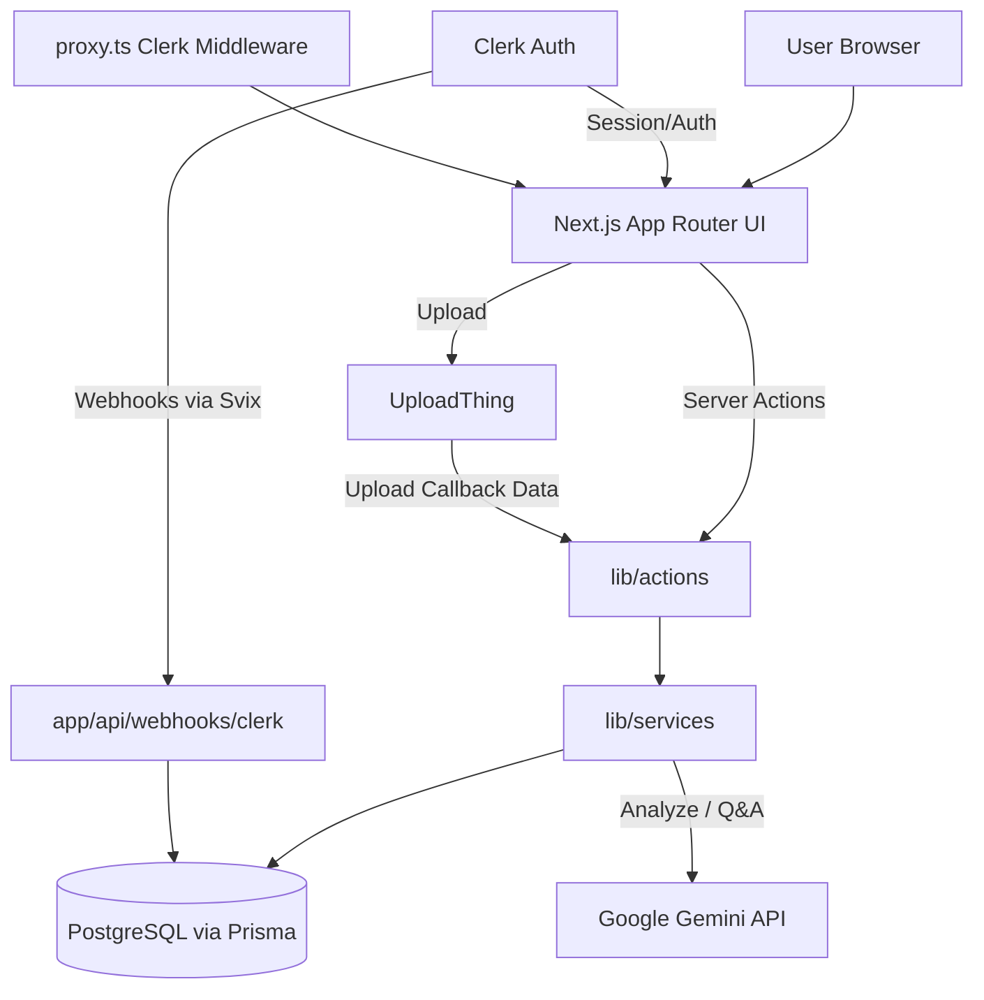

# Project Architecture & Technology Stack

**Project:** LexiChain (BFSI Contract Intelligence Platform)  
**Date:** March 8, 2026  
**Scope:** Rationale for choosing Next.js, current stack snapshot, and end-to-end communication architecture.

## 1) Why We Chose Next.js

We selected **Next.js** because it aligns with the exact technical and product needs of this project:

1. **Full-stack in one framework**  
   The project combines UI, backend logic, and API endpoints in a single codebase (`app` routes, server actions, route handlers). This reduces context switching and speeds up delivery.

2. **App Router structure for product domains**  
   Route groups like `(auth)` and `(dashboard)` map directly to business areas, making navigation and ownership clear.

3. **Server Actions for secure business operations**  
   Operations such as saving contracts, analysis triggers, and fetching statistics are executed server-side (`"use server"`), which keeps privileged logic off the client.

4. **Built-in route handlers for integrations**  
   Integrations such as Clerk webhooks and UploadThing endpoints are implemented natively in `app/api/*`, with no separate backend server required.

5. **Strong authentication integration**  
   Clerk works naturally with Next.js server functions (`auth()`), middleware/proxy route protection, and auth UI pages.

6. **Performance and UX benefits**  
   Next.js supports hybrid rendering and optimized routing while allowing rich client interactivity where needed (dashboard, charts, upload flows).

7. **Excellent TypeScript compatibility**  
   The project uses strict TypeScript with shared models and service layers, improving reliability in a data-sensitive BFSI context.

---

## 2) Current Stack (As Implemented)

### Core Platform
- **Next.js:** `16.1.6`
- **React:** `19.2.3`
- **TypeScript:** `5.x` (strict mode)
- **Node/NPM scripts:** standard `dev`, `build`, `start`, `lint`

### UI & Frontend
- **Tailwind CSS** + `tailwindcss-animate`
- **shadcn/ui** (New York style) built on **Radix UI** primitives
- **Lucide React** icons
- **Motion** (`motion/react`) for animations
- **Recharts** for analytics visualizations
- **Sonner** for toast notifications
- **next-themes** for dark/light mode

### Authentication & Access Control
- **Clerk** (`@clerk/nextjs`, `@clerk/themes`)
- Route protection through `proxy.ts` using Clerk middleware
- Auth flows with Clerk `SignIn` and `SignUp` pages
- Webhook verification using **Svix** for secure user lifecycle sync

### Data Layer
- **PostgreSQL** via **Prisma ORM** (`@prisma/client`, `prisma`)
- Main entities: `User` and `Contract`
- Enum-based domain modeling (`ContractType`, `ContractStatus`)

### File Ingestion & Storage
- **UploadThing** (`uploadthing`, `@uploadthing/react`)
- Controlled file constraints and authenticated upload middleware
- Upload completion callback integrated with contract persistence

### AI & Contract Intelligence
- **Google Generative AI** SDK (`@google/generative-ai`)
- Gemini model (`gemini-2.5-flash`) for:
  - contract extraction,
  - structured summary generation,
  - key-point generation,
  - contract Q&A.

### Validation / Forms / Utility
- **react-hook-form**, **zod**, `@hookform/resolvers`
- Utility stack: `clsx`, `class-variance-authority`, `tailwind-merge`, etc.

---

## 3) Architecture Overview

The app follows a **layered Next.js architecture** with clear responsibilities:

1. **Presentation Layer (Client Components / Views)**
   - Route UI in `app/*`
   - Reusable view modules in `components/views/*`
   - Design-system components in `components/ui/*`

2. **Application Layer (Server Actions)**
   - `lib/actions/*`
   - Entry point for authenticated server-side operations initiated by the UI

3. **Domain/Service Layer**
   - `lib/services/*`
   - Encapsulates business logic (contracts, AI analysis, stats, storage helpers)

4. **Persistence Layer**
   - `lib/db/prisma.ts` + `prisma/schema.prisma`
   - Database operations and schema modeling

5. **Integration Layer (External Systems)**
   - Route handlers in `app/api/*` (UploadThing, Clerk webhooks)
   - External providers: Clerk, UploadThing, Gemini API

### High-Level Component Map
- **Public Marketing Experience:** `app/page.tsx` + `components/views/Home/*`
- **Authenticated Workspace:** `app/(dashboard)/*` + dashboard navigation/layout
- **Document Operations:** upload form, contract list, AI actions, analytics charts

---

## 4) How Each Part Communicates

### A. Authentication and Access
1. User requests a protected page.
2. `proxy.ts` (Clerk middleware) checks route rules and enforces authentication.
3. Inside server layouts/actions, `auth()` verifies user identity again for operation-level security.
4. Clerk webhook events (`app/api/webhooks/clerk/route.ts`) synchronize user records into PostgreSQL.

**Result:** route-level and operation-level protection, plus identity consistency between Clerk and local DB.

### B. Contract Upload and Persistence
1. User uploads a file from `ContractUploadForm` (client).
2. Upload is sent to UploadThing endpoint (`/api/uploadthing`).
3. UploadThing middleware validates authenticated user.
4. On completion, client calls server action `saveContract`.
5. Server action delegates to `ContractService.create`.
6. Service resolves local user via `clerkId` and inserts `Contract` record with status lifecycle.
7. Paths are revalidated so UI refreshes with latest data.

**Result:** secure file ingestion + persistent contract metadata in one flow.

### C. Contract Analysis (AI Enrichment)
1. User clicks “Analyze” in contracts list.
2. Client triggers `analyzeContractAction` (server action).
3. Action validates auth, fetches contract, sets status to `PROCESSING`.
4. `AIService` downloads file URL and sends content to Gemini.
5. AI JSON output is validated and normalized.
6. `ContractService.updateWithAIResults` saves extracted fields (`summary`, `keyPoints`, type, dates, premium, etc.) and marks status `COMPLETED`.
7. Failures set status to `FAILED`.

**Result:** contract moves from raw upload to structured intelligence record.

### D. Analytics and Dashboard Data
1. Dashboard UI calls `getStatsAction`.
2. Action validates user and calls `stats.service`.
3. Service runs Prisma aggregations/groupings.
4. Data is returned as dashboard KPIs + chart-ready payloads.
5. Recharts renders trend/type/status analytics on the client.

**Result:** real-time operational visibility from server-computed metrics.

### E. Contract Q&A
1. User asks question in contract context.
2. Client calls `askContractQuestionAction`.
3. Server action fetches contract + analysis context.
4. `AIService.askAboutContract` sends prompt + metadata/extracted content to Gemini.
5. Sanitized answer returns to chat UI.

**Result:** contextual AI assistant grounded in analyzed contract data.

---

## 5) Runtime Communication Diagram

---

## 6) Architecture Characteristics

### Strengths
- **Single cohesive full-stack codebase** with clear file-system boundaries
- **Fast feature delivery** using App Router + server actions
- **Good security baseline** (middleware + server auth checks + webhook verification)
- **Strong type safety** across UI, actions, services, and data models
- **Integration-ready design** for AI/document workflows

### Current Maturity Notes
- AI execution is implemented server-side and can be triggered from user workflow.
- Existing comments already indicate a future path for queue-based background orchestration in production-scale scenarios.

---

## 7) Conclusion

Next.js is the right foundation for this BFSI platform because it enables secure, full-stack product development in one architecture: rich UI, authenticated server operations, API integrations, and data persistence.

The current stack is modern, production-oriented, and well-aligned with the project goals: **contract ingestion, AI enrichment, analytics visibility, and secure user-scoped access**.