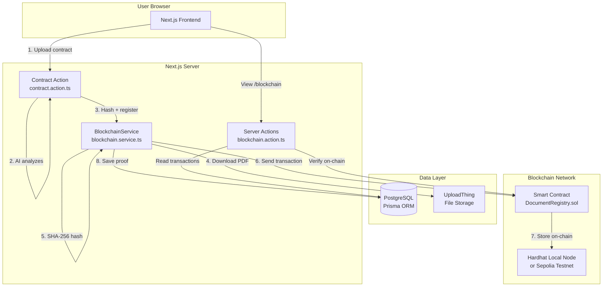
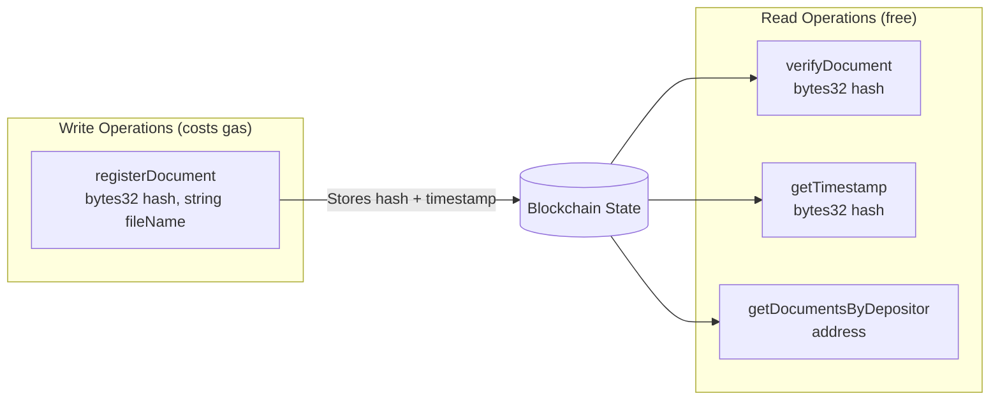
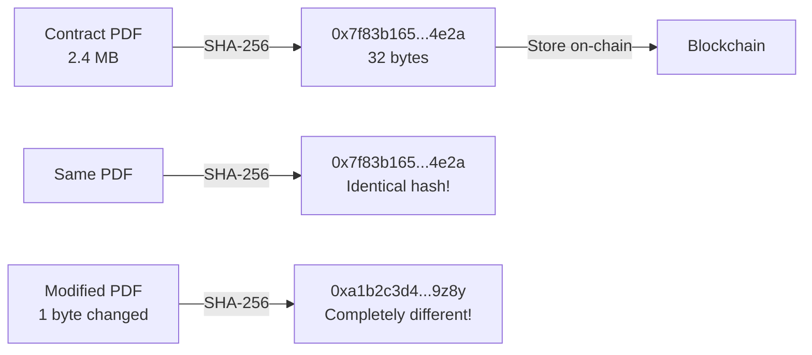
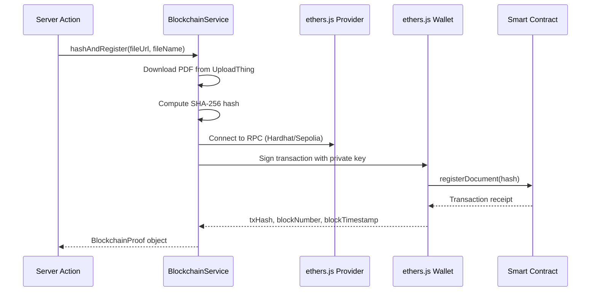
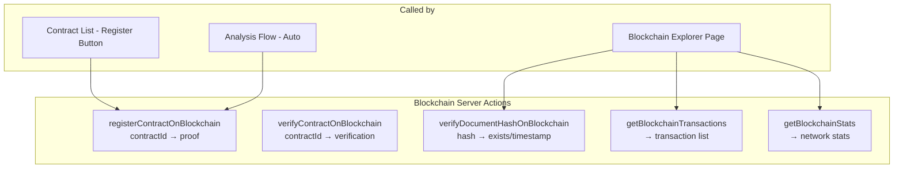
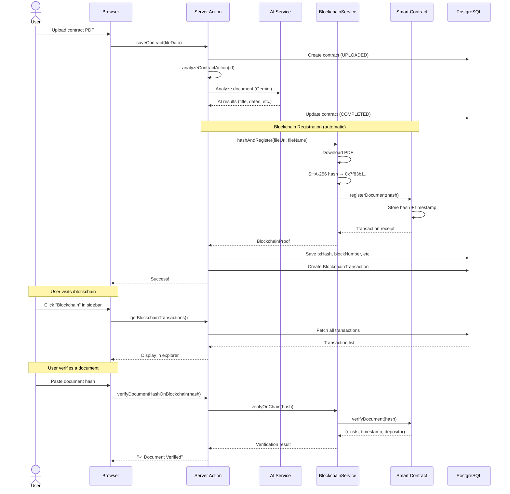

# 🔗 Blockchain Module — Complete Documentation

> **LexiChain BFSI Platform — Chapter: Blockchain Integration**
>
> This document explains everything about the blockchain module:
> what it does, how it works, how the code is organized, and how to run it.
> Written for beginners with no prior blockchain knowledge.

---

## Table of Contents

1. [What is Blockchain and Why Do We Need It?](#1-what-is-blockchain-and-why-do-we-need-it)
2. [What Does Our Blockchain Module Do?](#2-what-does-our-blockchain-module-do)
3. [Architecture Overview](#3-architecture-overview)
4. [Smart Contract: DocumentRegistry.sol](#4-smart-contract-documentregistrysol)
5. [Server-Side Integration: BlockchainService](#5-server-side-integration-blockchainservice)
6. [Database Schema: Storing Proof Data](#6-database-schema-storing-proof-data)
7. [Server Actions: The API Layer](#7-server-actions-the-api-layer)
8. [Frontend: Blockchain Explorer Page](#8-frontend-blockchain-explorer-page)
9. [Complete Data Flow](#9-complete-data-flow)
10. [How to Run Locally](#10-how-to-run-locally)
11. [Deploying to Sepolia Testnet](#11-deploying-to-sepolia-testnet)
12. [Technology Choices & Rationale](#12-technology-choices--rationale)
13. [File Reference](#13-file-reference)

---

## 1. What is Blockchain and Why Do We Need It?

### The Problem (in simple terms)

When a client sends an insurance claim or uploads a contract, they need **proof** that they submitted it on a specific date. Without proof:
- The insurance company could claim "we never received it"
- Deadlines could be disputed
- There's no transparency

### The Solution: Blockchain as a Notary

A **blockchain** is like a public, tamper-proof notebook. Once you write something in it, **nobody can erase or modify it** — not even the person who wrote it.

We use the blockchain as a **digital notary**:
1. We take the uploaded contract PDF
2. We create a unique **fingerprint** (hash) of that file
3. We write that fingerprint into the blockchain with a timestamp
4. Now there's permanent, verifiable proof that this exact document existed at this exact time

> **Key insight**: We don't store the actual document on the blockchain (that would be expensive). We only store its **fingerprint** (64 characters). If the document ever changes, even by one byte, the fingerprint would be completely different — proving tampering.

### What is a Smart Contract?

A **smart contract** is a program that runs on the blockchain. Think of it as a vending machine:
- You put in a coin (send a transaction)
- The machine executes its programmed logic
- The result is permanent and visible to everyone

Our smart contract (`DocumentRegistry.sol`) has two main functions:
- **Register**: Store a document fingerprint with a timestamp
- **Verify**: Check if a fingerprint exists and when it was stored

---

## 2. What Does Our Blockchain Module Do?

### Features Implemented

| Feature | Description |
|---------|-------------|
| **Auto-Registration** | After AI analyzes a contract, its hash is automatically registered on-chain |
| **Manual Registration** | Users can register unregistered contracts via the Blockchain Explorer |
| **Document Verification** | Paste any document hash to check if it exists on-chain |
| **Transaction Explorer** | View all blockchain transactions with details |
| **Network Stats** | Live stats: verified documents, latest block, network status |
| **Proof Badges** | Contract list shows which contracts are blockchain-verified |

### What Happens When a User Uploads a Contract?

```
User uploads PDF → AI analyzes it → Blockchain registers the hash
```

The entire flow is automatic. The user doesn't need:
- ❌ MetaMask or any wallet
- ❌ Cryptocurrency knowledge
- ❌ To pay anything

Everything runs **server-side** with a platform wallet.

---

## 3. Architecture Overview

### High-Level Flow



### Network Modes

| Mode | When | URL | Cost |
|------|------|-----|------|
| **Hardhat** | Development | `http://127.0.0.1:8545` | Free (local) |
| **Sepolia** | Demo/Presentation | Via Alchemy/Infura RPC | Free (testnet) |

The mode is controlled by a single env variable: `BLOCKCHAIN_NETWORK`.

---

## 4. Smart Contract: DocumentRegistry.sol

**Location**: `blockchain/contracts/DocumentRegistry.sol`

### What It Does

The smart contract is written in **Solidity** (the programming language for Ethereum). It stores document fingerprints on the blockchain.

### Data Structures

```solidity
struct DocumentRecord {
    uint256 timestamp;   // When the document was registered
    address depositor;   // Who registered it (our server wallet)
    string fileName;     // Original file name
    bool exists;         // Whether this record is valid
}
```

### Core Functions



#### `registerDocument(bytes32 _docHash)`
- **Purpose**: Store a document hash on-chain
- **Access**: Only the contract owner (our server wallet)
- **Guard**: Prevents duplicate registration (same hash can't be registered twice)
- **Event**: Emits `DocumentRegistered` for off-chain indexing

#### `verifyDocument(bytes32 _docHash)`
- **Purpose**: Check if a hash exists and get its details
- **Cost**: Free (read-only, no gas)
- **Returns**: `(exists, timestamp, depositor)`

### How the Hash Works



> **SHA-256** is a one-way function. You can't reconstruct the document from the hash, but the same document always produces the same hash.

### Testing

14 tests cover all functionality:

```
✓ should set the deployer as owner
✓ should start with zero documents
✓ should register a document and emit event
✓ should store correct timestamp
✓ should increment totalDocuments counter
✓ should prevent duplicate registration
✓ should allow different users to register different documents
✓ should verify a registered document
✓ should return false for unregistered document
✓ should track all documents by a depositor
✓ should return correct document count
✓ should transfer ownership
✓ should prevent non-owner from transferring ownership
✓ should prevent transfer to zero address
```

---

## 5. Server-Side Integration: BlockchainService

**Location**: `lib/services/blockchain.service.ts`

### Why Server-Side?

Most blockchain dApps require users to install MetaMask and sign transactions. This is bad UX for a BFSI enterprise platform because:
- Users shouldn't need crypto knowledge
- The platform manages documents, not individual users
- Server-side signing is more reliable

Instead, we use a **server wallet**: a private key stored in `.env` that the server uses to sign transactions automatically.

### How It Connects to the Blockchain



### Key Methods

| Method | Purpose | Gas Cost |
|--------|---------|----------|
| `hashDocument(fileUrl)` | Download file + compute SHA-256 | None (off-chain) |
| `registerOnChain(hash, fileName)` | Send tx to smart contract | ~50,000 gas |
| `verifyOnChain(hash)` | Read-only check | Free |
| `hashAndRegister(fileUrl, fileName)` | Combined: hash + register | ~50,000 gas |
| `getNetworkStats()` | Get block number, total docs | Free |
| `isConfigured()` | Check if env vars are set | None |

### Graceful Degradation

If blockchain is not configured (env vars missing), the service returns `isConfigured() = false` and all blockchain features are silently disabled. The rest of the app works normally.

---

## 6. Database Schema: Storing Proof Data

**Location**: `prisma/schema.prisma`

### Contract Model (updated fields)

```prisma
model Contract {
  // ... existing fields ...

  // Blockchain proof-of-deposit
  documentHash      String?   // SHA-256 hash
  txHash            String?   // Ethereum transaction hash
  blockNumber       Int?      // Block number
  blockTimestamp    DateTime?  // Block timestamp
  blockchainNetwork String?   // 'hardhat' | 'sepolia'
  contractAddress   String?   // Smart contract address
}
```

### BlockchainTransaction Model (new)

```prisma
model BlockchainTransaction {
  id              String   @id
  userId          String   // Who triggered the registration
  contractId      String   // Which contract was registered
  documentHash    String   // SHA-256 hash
  txHash          String   @unique  // Ethereum tx hash
  blockNumber     Int      // Block where tx was mined
  blockTimestamp  DateTime // Proof timestamp
  network         String   // 'hardhat' | 'sepolia'
  contractAddress String   // Smart contract address
  status          String   // PENDING, CONFIRMED, FAILED
  createdAt       DateTime
}
```

### Why Two Places?

- **Contract fields**: Quick access to proof data when displaying a single contract
- **BlockchainTransaction**: Separate table for the explorer page, supports querying all transactions for a user independently of contracts

---

## 7. Server Actions: The API Layer

**Location**: `features/blockchain/api/blockchain.action.ts`

### Actions Available



### Auto-Registration Flow

In `features/contracts/api/contract.action.ts`, after AI analysis completes:

```typescript
// After AI analysis + RAG chunking...

try {
  if (BlockchainService.isConfigured()) {
    const proof = await BlockchainService.hashAndRegister(
      contract.fileUrl,
      contract.fileName
    );

    // Save proof to Contract + BlockchainTransaction
    await prisma.contract.update({...});
    await prisma.blockchainTransaction.create({...});
  }
} catch (blockchainError) {
  // Non-blocking: blockchain failure doesn't break analysis
  console.warn("Blockchain registration skipped:", blockchainError);
}
```

> **Critical design decision**: Blockchain registration is wrapped in a try/catch. If the Hardhat node is down or there's a network issue, the AI analysis still completes successfully. Blockchain is an enhancement, not a dependency.

---

## 8. Frontend: Blockchain Explorer Page

**Location**: `app/(dashboard)/blockchain/page.tsx`

### Page Layout

```
┌─────────────────────────────────────────────────┐
│  🔗 Blockchain Explorer           [Refresh]     │
├────────────┬────────────┬──────────┬────────────┤
│ Verified   │ Latest     │ Network  │ Wallet     │
│ Documents  │ Block      │ Status   │ Address    │
│    12      │ #847       │ ● Live   │ 0xf39F...  │
├────────────┴────────────┴──────────┴────────────┤
│ ⚠️ 3 contracts not yet on blockchain            │
│ ┌─ Insurance Auto      [Register] ─┐            │
│ └─ Home Loan Policy    [Register] ─┘            │
├──────────────────────┬──────────────────────────┤
│  Transaction History │  Verify Document         │
│  ────────────────── │  ──────────────────       │
│  ✓ Insurance Auto    │  [Hash input field]      │
│    Tx: 0x7f83...     │  [Verify On-Chain]       │
│    Block: #845       │                          │
│    Time: Apr 19      │  ✓ Document Verified     │
│  ──────────────────  │    Timestamp: ...        │
│  ✓ Home Loan         │    Depositor: 0xf39F..  │
│    Tx: 0xa1b2...     │                          │
└──────────────────────┴──────────────────────────┘
```

### Navigation

The Blockchain page is accessible from the sidebar navigation at `/blockchain`, alongside Analytics and Contracts.

---

## 9. Complete Data Flow

### End-to-End: Upload → Proof



---

## 10. How to Run Locally

### Prerequisites
- Node.js installed
- The Next.js app running (`npm run dev`)

### Step 1: Start the Hardhat Node

Open a **new terminal** and run:

```bash
cd blockchain
npx hardhat node
```

This starts a local Ethereum blockchain at `http://127.0.0.1:8545` with 20 pre-funded accounts (10,000 ETH each).

> ⚠️ **Keep this terminal open!** The node must be running for blockchain features to work.

### Step 2: Deploy the Smart Contract

In another terminal:

```bash
cd blockchain
npx hardhat run scripts/deploy.ts --network localhost
```

Copy the contract address and put it in your `.env`:

```env
BLOCKCHAIN_CONTRACT_ADDRESS=0x5FbDB2315678afecb367f032d93F642f64180aa3
```

### Step 3: Start the Next.js App

```bash
npm run dev
```

### Step 4: Test the Flow

1. Upload a contract PDF
2. Wait for AI analysis to complete
3. Check the blockchain icon/badge on the contract
4. Visit `/blockchain` to see the transaction in the explorer
5. Copy a document hash and paste it in the verification panel

### Important Notes

- If you restart the Hardhat node, you need to **redeploy** the contract (step 2) because the local blockchain state is reset
- The Hardhat node logs every transaction in real-time — you can watch the blockchain activity live
- All blockchain features gracefully degrade: if the node is offline, the app still works normally without blockchain

---

## 11. Deploying to Sepolia Testnet

For your PFE presentation, you can deploy to the real Ethereum Sepolia testnet to get actual Etherscan links.

### Step 1: Get a Free RPC URL

1. Go to [alchemy.com](https://alchemy.com) (free account)
2. Create a new app → select "Ethereum Sepolia"
3. Copy the HTTPS URL

### Step 2: Get Free Sepolia ETH

1. Go to [sepoliafaucet.com](https://sepoliafaucet.com) or [faucets.chain.link](https://faucets.chain.link)
2. Paste your wallet address
3. Receive 0.5 Sepolia ETH (enough for hundreds of transactions)

### Step 3: Update .env

```env
BLOCKCHAIN_NETWORK=sepolia
BLOCKCHAIN_RPC_URL=https://eth-sepolia.g.alchemy.com/v2/YOUR_KEY
BLOCKCHAIN_PRIVATE_KEY=your_sepolia_wallet_private_key
BLOCKCHAIN_CONTRACT_ADDRESS=  # Will be filled after deployment
```

### Step 4: Deploy to Sepolia

```bash
# Set env vars for hardhat
set SEPOLIA_RPC_URL=https://eth-sepolia.g.alchemy.com/v2/YOUR_KEY
set DEPLOYER_PRIVATE_KEY=your_private_key

cd blockchain
npx hardhat run scripts/deploy.ts --network sepolia
```

### Step 5: Verify on Etherscan

After deploying, transactions will have real Etherscan links:
```
https://sepolia.etherscan.io/tx/0x...
```

---

## 12. Technology Choices & Rationale

| Technology | Why We Chose It |
|-----------|----------------|
| **Solidity 0.8.24** | Latest stable version with built-in overflow protection |
| **Hardhat** | Industry standard for Solidity development, free local blockchain |
| **ethers.js v6** | Modern, lightweight, TypeScript-native Ethereum library |
| **SHA-256** | Standard cryptographic hash, deterministic, collision-resistant |
| **Server-side wallet** | Users don't need MetaMask; enterprise-grade UX |
| **Sepolia testnet** | Official Ethereum testnet, free, has Etherscan explorer |
| **Graceful degradation** | Blockchain is optional; app works perfectly without it |

### Why NOT Web3j / Java?

The original project spec suggested Web3j (Java library). We chose ethers.js instead because:
1. Our backend is **Next.js/TypeScript**, not Spring Boot
2. ethers.js has **better TypeScript support** and is more actively maintained
3. Both libraries do the same job — interact with Ethereum — but ethers.js is native to our stack

---

## 13. File Reference

### Smart Contract Layer
| File | Purpose |
|------|---------|
| `blockchain/contracts/DocumentRegistry.sol` | Solidity smart contract |
| `blockchain/test/DocumentRegistry.test.ts` | 14 comprehensive tests |
| `blockchain/scripts/deploy.ts` | Deployment script |
| `blockchain/hardhat.config.ts` | Hardhat configuration |
| `blockchain/package.json` | Hardhat dependencies |

### Service Layer
| File | Purpose |
|------|---------|
| `lib/services/blockchain.service.ts` | Core blockchain interactions |
| `lib/services/blockchain.types.ts` | TypeScript type definitions |

### Server Actions
| File | Purpose |
|------|---------|
| `features/blockchain/api/blockchain.action.ts` | Blockchain server actions |
| `features/contracts/api/contract.action.ts` | Updated with auto-registration |

### Frontend
| File | Purpose |
|------|---------|
| `app/(dashboard)/blockchain/page.tsx` | Blockchain Explorer page |
| `app/(dashboard)/blockchain/layout.tsx` | Page metadata |
| `components/layout/navigation.tsx` | Updated with blockchain link |

### Database
| File | Purpose |
|------|---------|
| `prisma/schema.prisma` | Updated with blockchain fields |

### Configuration
| File | Purpose |
|------|---------|
| `.env` | Blockchain env vars |
| `.env.example` | Template for new developers |
| `.gitignore` | Blockchain artifacts excluded |

---

## Glossary

| Term | Definition |
|------|-----------|
| **Hash** | A fixed-size fingerprint of data. Same input → same output. |
| **SHA-256** | A specific hash algorithm producing 256-bit (32-byte) outputs |
| **Smart Contract** | A program stored on the blockchain that executes automatically |
| **Gas** | The fee for executing operations on Ethereum (free on testnet) |
| **Block** | A batch of transactions grouped together on the blockchain |
| **Transaction (Tx)** | A single operation on the blockchain (e.g., registering a hash) |
| **Tx Hash** | A unique identifier for a transaction (like a receipt number) |
| **Block Number** | The sequential number of the block containing a transaction |
| **Block Timestamp** | The time the block was created (proof of when the tx happened) |
| **Private Key** | Secret key used to sign transactions (like a password) |
| **Address** | Public identifier derived from the private key (like a username) |
| **ABI** | Application Binary Interface — the "API spec" of a smart contract |
| **Hardhat** | Development tool for writing, testing, and deploying smart contracts |
| **Sepolia** | Ethereum test network for free experimentation |
| **ethers.js** | JavaScript library for interacting with the Ethereum blockchain |
| **Faucet** | A service that gives free test ETH for development |
