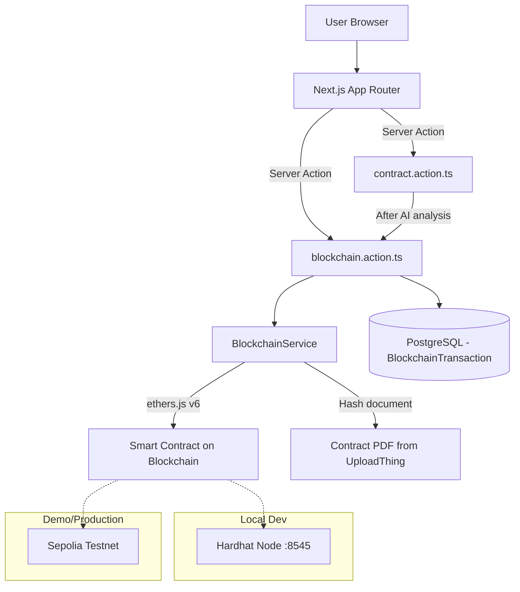

# Blockchain Integration — LexiChain BFSI Platform

## Goal

Add a **fully functional, 100% free** blockchain module to the existing LexiChain platform. This module provides:

1. **Proof of Deposit** — SHA-256 hash of each contract document is stored on-chain with a timestamp, making submission dates provable and tamper-proof.
2. **On-chain Verification** — Anyone can verify that a document existed at a specific time.
3. **Blockchain Explorer UI** — A new `/blockchain` page showing all on-chain transactions + per-contract verification status.

---

## User Review Required

> [!IMPORTANT]
> **Zero cost guaranteed.** The entire implementation uses:
> - **Hardhat local node** for development (free, instant, unlimited)
> - **Ethereum Sepolia testnet** for demo/presentation (free test ETH from faucets)
> - No MetaMask required for end-users — all blockchain operations run **server-side** via a backend wallet

> [!WARNING]
> **Server-side wallet approach**: Instead of requiring users to install MetaMask and sign transactions, the server holds a private key and signs transactions on behalf of the platform. This is the right UX for a BFSI enterprise platform (users shouldn't need crypto knowledge). The private key is stored in `.env` and never exposed to the client.

> [!IMPORTANT]
> **Dual-mode architecture**: 
> - `NODE_ENV=development` → Hardhat local node (`http://127.0.0.1:8545`)
> - `NODE_ENV=production` or env flag → Sepolia testnet (via free Alchemy/Infura RPC)
> 
> You can switch between modes with a single env variable change.

---

## Proposed Changes

### Component 1: Smart Contract (Hardhat + Solidity)

Creates a standalone `blockchain/` directory at the project root with a Hardhat project for developing, testing, and deploying the smart contract.

#### [NEW] [blockchain/contracts/DocumentRegistry.sol](file:///c:/Stage/Project-PFE/bfsi-project/blockchain/contracts/DocumentRegistry.sol)

Solidity smart contract with:
- `registerDocument(bytes32 docHash, string calldata fileName)` — stores hash + metadata on-chain
- `verifyDocument(bytes32 docHash)` — checks if a hash exists and returns timestamp + depositor
- `getDocumentsByDepositor(address depositor)` — lists all docs registered by an address
- Events: `DocumentRegistered(bytes32 indexed docHash, uint256 timestamp, address indexed depositor, string fileName)`
- Modifier to prevent duplicate registrations

#### [NEW] [blockchain/hardhat.config.ts](file:///c:/Stage/Project-PFE/bfsi-project/blockchain/hardhat.config.ts)

Hardhat config with:
- Local Hardhat network (default, free)
- Sepolia network config (reads RPC URL + private key from env)
- Solidity 0.8.24 compiler

#### [NEW] [blockchain/test/DocumentRegistry.test.ts](file:///c:/Stage/Project-PFE/bfsi-project/blockchain/test/DocumentRegistry.test.ts)

Comprehensive tests:
- Register a document and verify timestamp
- Prevent duplicate registration
- Verify non-existent document returns zero
- Multiple documents by same depositor

#### [NEW] [blockchain/scripts/deploy.ts](file:///c:/Stage/Project-PFE/bfsi-project/blockchain/scripts/deploy.ts)

Deployment script that outputs the contract address for use in `.env`.

#### [NEW] [blockchain/package.json](file:///c:/Stage/Project-PFE/bfsi-project/blockchain/package.json)

Separate package.json for the Hardhat project (keeps blockchain dependencies isolated from the Next.js app).

---

### Component 2: Next.js Blockchain Service Layer

Server-side service that connects to the blockchain from Next.js server actions. No browser wallet needed.

#### [NEW] [lib/services/blockchain.service.ts](file:///c:/Stage/Project-PFE/bfsi-project/lib/services/blockchain.service.ts)

Core blockchain service:
- `hashDocument(fileUrl: string): Promise<string>` — downloads contract PDF and computes SHA-256
- `registerOnChain(documentHash: string, fileName: string): Promise<{ txHash, blockNumber, blockTimestamp }>` — sends transaction to smart contract
- `verifyOnChain(documentHash: string): Promise<{ exists, timestamp, depositor }>` — reads on-chain data
- Uses `ethers.js v6` with `JsonRpcProvider` + `Wallet` (server-side, no MetaMask)
- Auto-detects network mode from env vars

#### [NEW] [lib/services/blockchain.types.ts](file:///c:/Stage/Project-PFE/bfsi-project/lib/services/blockchain.types.ts)

TypeScript types for blockchain data:
```typescript
interface BlockchainProof {
  documentHash: string;
  txHash: string;
  blockNumber: number;
  blockTimestamp: Date;
  network: 'hardhat' | 'sepolia';
  contractAddress: string;
  explorerUrl: string | null; // Sepolia etherscan link
}
```

---

### Component 3: Server Actions & Integration

#### [NEW] [features/blockchain/api/blockchain.action.ts](file:///c:/Stage/Project-PFE/bfsi-project/features/blockchain/api/blockchain.action.ts)

New server actions:
- `registerContractOnBlockchain(contractId: string)` — hashes + registers + saves proof to DB
- `verifyContractOnBlockchain(contractId: string)` — verifies on-chain status
- `getBlockchainTransactions()` — fetches all blockchain proofs for the authenticated user

#### [MODIFY] [features/contracts/api/contract.action.ts](file:///c:/Stage/Project-PFE/bfsi-project/features/contracts/api/contract.action.ts)

After successful AI analysis, **automatically trigger** blockchain registration:
- In `analyzeContractAction()`, after `ContractService.updateWithAIResults()`, call `BlockchainService.hashAndRegister()`
- Save `documentHash`, `txHash` to the contract record
- This means every analyzed contract gets an automatic on-chain proof

---

### Component 4: Database Schema Update

#### [MODIFY] [prisma/schema.prisma](file:///c:/Stage/Project-PFE/bfsi-project/prisma/schema.prisma)

Expand the existing blockchain placeholder fields on `Contract`:
```diff
  // Blockchain (later)
- documentHash String?
- txHash       String?
- ipfsUrl      String?
+ documentHash    String?
+ txHash          String?
+ blockNumber     Int?
+ blockTimestamp   DateTime?
+ blockchainNetwork String?  // 'hardhat' | 'sepolia'
+ contractAddress   String?  // smart contract address used
```

Add a new `BlockchainTransaction` model for the explorer view:
```prisma
model BlockchainTransaction {
  id             String   @id @default(cuid())
  userId         String
  user           User     @relation(...)
  contractId     String
  contract       Contract @relation(...)
  
  documentHash   String
  txHash         String   @unique
  blockNumber    Int
  blockTimestamp  DateTime
  network        String   // 'hardhat' | 'sepolia'
  contractAddress String
  status         String   @default("CONFIRMED") // PENDING, CONFIRMED, FAILED
  
  createdAt      DateTime @default(now())
}
```

---

### Component 5: Frontend — Blockchain Explorer Page

#### [NEW] [app/(dashboard)/blockchain/page.tsx](file:///c:/Stage/Project-PFE/bfsi-project/app/(dashboard)/blockchain/page.tsx)

New dashboard page at `/blockchain` with:
- **Header stats**: Total verified contracts, latest block, network status
- **Transaction table**: All blockchain proofs with txHash, contract name, timestamp, verification status
- **Verification panel**: Paste a document hash to check its on-chain status
- **Network indicator**: Shows whether connected to Hardhat (local) or Sepolia

#### [NEW] [features/blockchain/components/blockchain-explorer.tsx](file:///c:/Stage/Project-PFE/bfsi-project/features/blockchain/components/blockchain-explorer.tsx)

Main explorer component with:
- Animated blockchain-themed cards
- Transaction list with expandable details
- Real-time verification status badges
- Network health indicator

#### [NEW] [features/blockchain/components/verify-document.tsx](file:///c:/Stage/Project-PFE/bfsi-project/features/blockchain/components/verify-document.tsx)

Standalone verification widget:
- File upload → compute hash → check on-chain
- Shows proof details if found (timestamp, block, depositor)
- Visual "Verified ✓" / "Not Found ✗" result

#### [NEW] [features/blockchain/components/blockchain-proof-badge.tsx](file:///c:/Stage/Project-PFE/bfsi-project/features/blockchain/components/blockchain-proof-badge.tsx)

Small badge component to show on contract cards:
- 🟢 "On-Chain Verified" (with txHash link)
- 🟡 "Pending" (registration in progress)
- ⚫ "Not Registered" (no blockchain proof yet)

---

### Component 6: Navigation & Integration Updates

#### [MODIFY] [components/layout/navigation.tsx](file:///c:/Stage/Project-PFE/bfsi-project/components/layout/navigation.tsx)

Add new nav item:
```typescript
{
  href: "/blockchain",
  label: "Blockchain",
  icon: <Link2 className="w-5 h-5" />,
  description: "On-chain proofs",
}
```

#### [MODIFY] [types/contract.types.ts](file:///c:/Stage/Project-PFE/bfsi-project/types/contract.types.ts)

Add blockchain fields to the Contract interface:
```typescript
blockNumber: number | null;
blockTimestamp: Date | null;
blockchainNetwork: string | null;
contractAddress: string | null;
```

#### [MODIFY] [.env.example](file:///c:/Stage/Project-PFE/bfsi-project/.env.example)

Add blockchain env vars:
```env
# Blockchain
BLOCKCHAIN_PRIVATE_KEY=        # Server wallet private key (Hardhat default for dev)
BLOCKCHAIN_RPC_URL=            # RPC endpoint (empty = Hardhat local)
BLOCKCHAIN_CONTRACT_ADDRESS=   # Deployed DocumentRegistry address
BLOCKCHAIN_NETWORK=hardhat     # 'hardhat' or 'sepolia'
SEPOLIA_RPC_URL=               # Free Alchemy/Infura Sepolia RPC
```

---

## Architecture Diagram



---

## Implementation Order

| Step | Component | Estimated Effort |
|------|-----------|-----------------|
| 1 | Hardhat project + Smart Contract + Tests | ~30 min |
| 2 | Deploy to local Hardhat node | ~5 min |
| 3 | `BlockchainService` (server-side ethers.js) | ~30 min |
| 4 | Prisma schema update + migration | ~10 min |
| 5 | Server actions (`blockchain.action.ts`) | ~20 min |
| 6 | Integration into `analyzeContractAction` | ~10 min |
| 7 | Blockchain Explorer page + components | ~45 min |
| 8 | Navigation update + proof badges | ~15 min |
| 9 | Deploy to Sepolia testnet (optional, for demo) | ~15 min |

**Total: ~3 hours of implementation**

---

## Open Questions

> [!IMPORTANT]
> **1. Auto-register vs. Manual button?**
> The plan currently auto-registers contracts on the blockchain after AI analysis completes. Alternatively, we could add a manual "Register on Blockchain" button per contract. Which do you prefer? (I recommend **both**: auto-register + manual re-register option)

> [!IMPORTANT]  
> **2. Sepolia for presentation?**
> Do you want me to also set up the Sepolia testnet deployment for your PFE presentation/jury? This gives you real Etherscan links to show. You'll just need to grab free Sepolia ETH from a faucet (takes 2 minutes). We can start with Hardhat local and add Sepolia later.

> [!IMPORTANT]
> **3. IPFS integration?**
> Your schema has an `ipfsUrl` field. Do you want to also store contract files on IPFS (using a free service like Pinata with 1GB free tier)? This would give you decentralized file storage + on-chain hash. Or should we skip this to keep things simpler?

---

## Verification Plan

### Automated Tests
1. **Smart contract tests** — `cd blockchain && npx hardhat test` (tests register, verify, duplicate prevention)
2. **Integration test** — Upload a contract → AI analysis → verify blockchain fields are populated in DB
3. **Service test** — Call `BlockchainService.hashDocument()` + `registerOnChain()` directly

### Manual Verification
1. Start Hardhat node → deploy contract → upload a contract in the app → check `/blockchain` page shows the transaction
2. Use the verification panel to re-verify a document hash
3. Check the contract detail view shows the "On-Chain Verified" badge
4. If Sepolia is configured: verify the txHash on [Sepolia Etherscan](https://sepolia.etherscan.io/)

